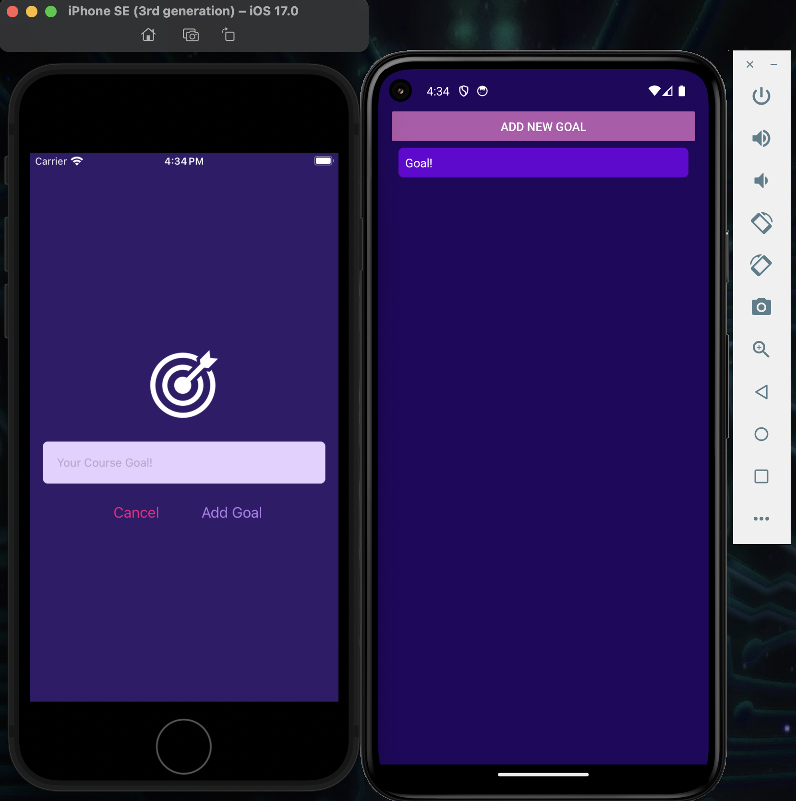

# JamMate

---
#### By Ambi Hidalgo
##### ambio.pk@gmail.com 

---
## About 
JamMate is Epicodus Capstone project. The aim of this application is to serve as a mobile matchmaking application for musicians, producers, mixers with one goal in mind: to collab and jam. Create your own WANTED ad as in a profile format: Seeking, inspiration, equipment and possibly upload your own demos to give others an idea to riff of your music. Matching will allow you to communicate with your matches via direct messaging to arrange a jam meetup. 

## Technologies Used
* React Native
* Firebase
* Javascript

## Setup/Installation Requirements
TBD

---

### Research & Planning Log
#### Sunday, 05/28
* 5:00pm: Concieve Idea, Write out capstone proposal, create technology plan
* 7:00pm -8:00pm : Research React Native via Youtube, compare between Flutter and React Native 

### Sunday, 06/4 

* 5:00pm-6:00pm: Sign up for React Native Udemy Course

### Friday, 6/16

* 3:00pm: Create Readme, repo and reformat capstone-proposal.md
* 7pm-8:50pm: Complete React Native Section 1: Getting Started, Add separate branch called UdemyProject1 to build practice app along with the course.

### Monday, 6/19

* 2:00pm: Finish setting up dev environment complete with Android and iOS emulation
          
* 4:00pm: Udemy Section 2: React Native Basics [Course Goals App]
* 7:00pm: Complete lessons Section 2 (12 to 23 out of 38) Learn Styling, Flexbox in Native, Learn  EventHandlers and adding data to state using hooks

### Tuesday, 6/27
* 7:00pm  Section 2: 24/38  
* 8:07 Section 2 Lessons 24-26/38 Learn ScrollView and FlatList props
* 9:20pm: Section 2  Lessons: 27-30 : Separate Application into separate  files, use props and explore 'Pressable' component 

### Wednesday, 6/28
* 2:30pm Section 2: 30/38 
* 4:30pm: Complete Section 2: 38/38 ✅, complete first practice app (goals app.)
    
* 4:50 : Add README to practice application 
* 8:00pm : Begin Section 4 (skip 3: debugging for now) Start practice Project2 (guess Number game)
* 9:30pm :  Complete Section 4: Lesson 45-52 of 78 Learn custom Button creation, platform styling, text specific input fields

### Thursday, 6/29
* 4:30pm - 6:00pm Lesson 52-56 Visual Feedback to Buttons

### Friday, 6/30
* 1:30pm: Section 3:57/78 Begin Game Logic
* 3:00pm: Section 3:59/78 Input Field error handling
* 5:30pm: Create Plan/design in notebook of Screens and Components. Screens determine which components will be necessary to handle what is shown to the user. Components listed to determine which components are going to be needed to be custom, such as buttons, profile display etc. This is the bare bones start of a game-plan. Docs will be reformatted and created again digitally.
    https://docs.google.com/presentation/d/1O1sLVeLzv1KDaUPaEyBdcASvCrg3iJYVJhbauGH5Ls0/edit#slide=id.p

### Monday, July 3rd

* 3:00pm-9:00pm Section 3: 60-69 : Start Game screens, Device screen restrictions, global color objects, import Native Icons, creating your own css, implementing icons into buttons.
---

## React Native Practice Applications
Goals Application 

https://github.com/ambibma/goals-react-native

Guess My Number

https://github.com/ambibma/guess-my-number

    
## Known Bugs

send bug concerns to ambio.pk@gmail.com

## License

Copyright Ambi Hidalgo(2023)